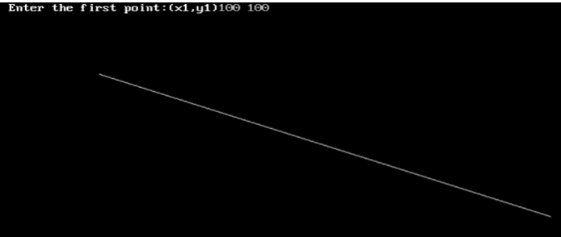

## Program to draw line using BSA Algorithm.

Name: Program to draw line using BSA Algorithm.

Date: April 29th, 2024

## Source Code

```c 
// BSA Algorithm

// Source Code

#include<stdio.h>
#include<conio.h>
#include<graphics.h>
#include<math.h>

void main(){
    int gd = DETECT, gm;
    int x1, y1, p, i, dx, dy, m;
    initgraph(&gd, &gm, "C:\\TURBOC3\\BGI");
    printf("Enter the first point(x1, y1)");
    scanf("%d%d", &x1, &y1);
    dx =  x2 - x1;
    dy =  y2 - y1;
    m = dx / dy;
    if(m <= 1){
        p = 2 * dy - dx;
        for(i = 0; i < dx; i++){
        putpixel(x1, y1, WHITE);
        if(p < 0){
            x1 = x1 + 1;
            p = p + 2 * dy;
        }else{
            y1 = y1 + 1;
            p = p + 2 * dy - 2 * dx;
        }
            }
    }else{
        p = 2 * dx - dy;
        putpixel(x1, y1, WHITE);
        if(p < 0){
            y1 = y1 + 1;
            p = p + 2 * dx;
        }else{
            x1 += 1;
            y1 += 1;
            p += (2 * dx) - (2 * dy);
        }
    }
    getch();
}
```

## Output

