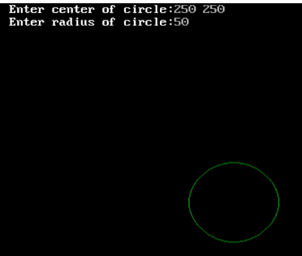

##  Program to draw a circle in green colour using midpoint circle algoritm

Name: Program to draw a circle in green colour using midpoint circle algoritm

Date: April 29th, 2024

## Source Code

```c 
// Program to draw a circle in green colour using midpoint circle algoritm

// Source Code

#include<stdio.h>
#include<conio.h>
#include<graphics.h>
#include<math.h>

int main()
{
    int gd=DETECT,gm;
    int x,y,p,r,xc,yc;
    initgraph(&gd,&gm,"C:\\TURBOC3\\BGI");
    printf("Enter the centre of the circle\n");
    scanf("%d%d",&xc,&yc);
    printf("Enter the radius of the circle\n");
    scanf("%d",&r);
    p=1-r;
    x=0;
    y=r;
    while(x<=y){
        putpixel(xc+x,yc+y,GREEN);
        putpixel(xc+x,yc-y,GREEN);
        putpixel(xc-x,yc-y,GREEN);
        putpixel(xc-x,yc+y,GREEN);
        putpixel(xc+y,yc+x,GREEN);
        putpixel(xc+y,yc-x,GREEN);
        putpixel(xc-y,yc-x,GREEN);
        putpixel(xc-y,yc+x,GREEN);
        if(p<0){
            x = x + 1;
            p=p+(2*x)+3;
        }
        else{
            x = x + 1;
            y = y - 1;
            p = p + (2*x) - (2*y)+5;
        }
    }
    getch();
}
```

## Output

