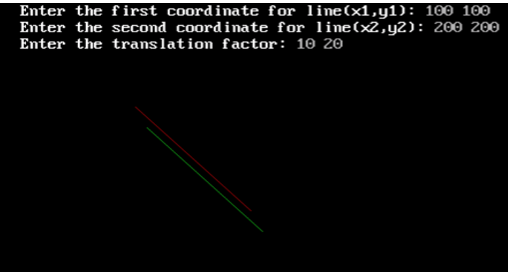

##  Program to translate a line with coordinate x1, y1, and x2,y2 with translate factor tx,ty. 

Name: Program to translate a line with coordinate x1, y1, and x2,y2 with translate factor tx,ty. 

Date: May 2nd, 2024

## Source Code

```c 
// Program to translate a line with coordinate x1, y1, and x2,y2 with translate factor tx,ty. 

// Source Code

#include<stdio.h>
#include<conio.h>
#include<graphics.h>
#include<math.h>

int main()
{
    int gd = DETECT, gm;
    //initial coordinate
    int x1,y1,x2,y2;
    // translation coordinate
    int tx,ty;
    // final coordinate after translation
    int x3,y3, x4,y4;
    initgraph(&gd, &gm, "C:\\TURBOC3\\BGI");
    printf("Enter the initial coordinate of the line (x1, y1): ");
    scanf("%d %d",&x1,&y1);
    printf("Enter the second coordinate of the line (x2, y2): ");
    scanf("%d %d",&x2,&y2);
    printf("Enter the translation factor: ");
    scanf("%f %f",&tx1,&ty1);
    //line befoew translation
    set color(RED);
    line(x1,y1,x2,y2);
    x3 = x1 + tx;
    y3 = y1 + ty;
    x4 = x2 + tx;
    y4 = y2 + ty;
    //line after translation
    set color(BLUE);
    line(x3,y3,x4,y4);
    getch();
}
```

## Output

