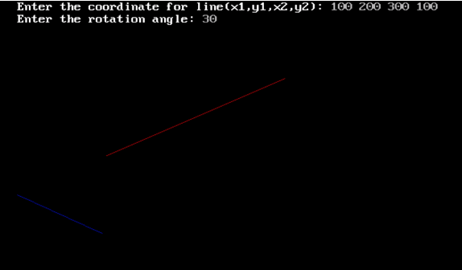

##   Program to rotate a line with coordinate

Name:  Program to rotate a line with coordinate

Date: May 3rd, 2024

## Source Code

```c 
// Program to rotate a line with coordinate

// Source Code

#include<stdio.h>
#include<conio.h>
#include<math.h>
#include<graphics.h>

void main(){
    int gd = DETECT, gm;
    float x1, y1, x2, y2, x3, y3, x4, y4, theta, r;
    initgraph(&gd, &gm, "C:\\TURBOC3\\BGI");
    printf("Enter the coordinates of the  line(x1, y1, x2, y2)\n");
    scanf("%f%f",&x1,&y1,&x2, &y2);
    printf("Enter the rotation angle:\n");
    scanf("%f",&theta);
    setcolor(RED);
    line(x1,y1,x2,y2);
    r = theta * (3.14/180);
    x3 = (x1 + cos(r)) * (y1 - sin(r));
    y3 = (x1 + sin(r)) * (y1 - cos(r));
    x4 = (x2 + cos(r)) * (y2 - sin(r));
    y4 = (x2 + sin(r)) * (y2 - cos(r));
    setcolor(BLUE);
    line(x3,y3,x4,y4);
    getch();
}
```

## Output

