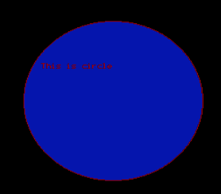

## Program to display a circle.

Name: Program to display a circle.

Date: April 22th, 2024

## Source Code

```c 
// Program to draw a circle

// Source Code

#include<stdio.h>
#include<conio.h>
#include<graphics.h>

void main(){
    int gd = DETECT, gm;
    int x1 = 100, x2 = 200, x3 = 300;
    initgraph(&gd, &gm, "C:\\TURBOC3\\BGI");
    setbkcolor(0);
    setcolor(4);
    circle(x1, x2, x3);
    setfillstyle(1,1);
    floodfillstyle(140, 140, 4);
    settextstyle(2,0,4);
    outtextxy(20, 150, "This is circle");
    getch();
}
```

## Output

