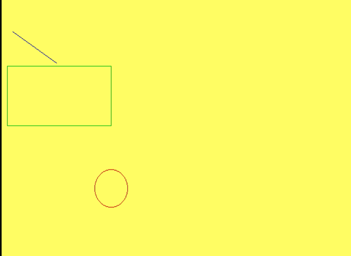

## Program to draw a line, rectangle and a circle in yellow background

Name: Program to draw a line, rectangle and a circle in yellow background

Date: April 16th, 2024

## Source Code

```c 
//Write a program to create yellow background & draw a line, rectangle and circle.

//Source Code
#include<stdio.h>
#include<graphics.h>
#include<conio.h>

void main(){
    int gd = DETECT, gm;
    initgraph(&gd, &gm, "C:\\TURBOC3\\BGI");
    setcbkcolor(YELLOW);
    setcolor(BLUE);
    line(100,100,20,50);
    setcolor(RED);
    circle(200,300,90);
    setcolor(GREEN);
    rectangle(200,250,15,110);
    getch();
}
```

## Output

