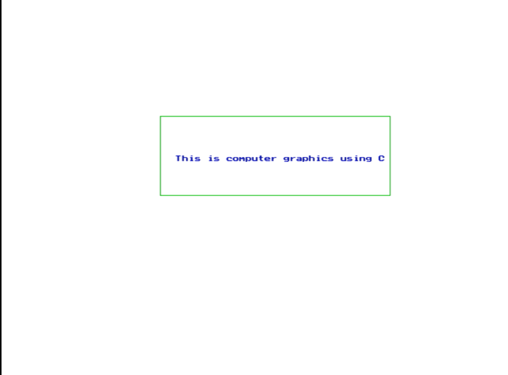

## Program to display the given question to print (This is Computer Graphics using C)

Name: Program to  the given question to print (This is Computer Graphics using C)

Date: April 17th, 2024

## Source Code

```c 
//Source Code

#include<stdio.h>
#include<conio.h>
#include<graphics.h>

void main(){
    int gd = DETECT, gm;
    initgraph(&gd, &gm, "C:\\TURBOC3\\BGI");
    setbkcolor(WHITE);
    setcolor(GREEN);
    rectangle(500,250,200,150);
    setcolor(BLUE);
    outtextxy(220, 200, "This is computer graphics using c");
    getch();
}
```

## Output

